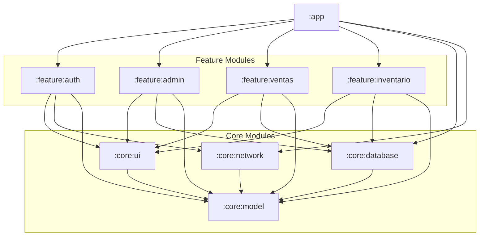

# Design: Multimodule Migration

Spec ID: `multimodule-migration`
Capability: `architecture`

This document details the architectural design for the multimodule migration of Bocatta POS, focusing on module hierarchy, dependency injection, and navigation.

## 1. Architectural Strategy

The system will transition from a monolithic `:app` structure to a layered, feature-based architecture heavily inspired by Google's *Now in Android* architectural guidelines. This structure enforces unidirectional data flow, separation of concerns, and strict boundaries to prevent circular dependencies and improve build times.

## 2. Gradle Module Graph Structure

To ensure a Directed Acyclic Graph (DAG) and prevent circular dependencies, modules are categorized into three distinct layers:

1.  **App Layer (`:app`)**: The entry point and integration layer. It has no business logic.
2.  **Feature Layer (`:feature:*`)**: Isolated functional areas of the application.
3.  **Core Layer (`:core:*`)**: Foundational utilities, data sources, and UI components shared across features.

### 2.1. Module Graph Diagram



### 2.2. Module Rules

*   **`:feature:*` modules MUST NOT depend on each other.** This prevents cyclic dependencies and allows features to be compiled, tested, and developed in isolation.
*   **`:core:*` modules MUST NOT depend on `:feature:*` modules.**
*   The **`:app` module** depends on everything necessary to wire the application together but contains zero UI screens or business logic view models.

## 3. Koin Dependency Injection Strategy

Koin provides runtime dependency injection. In a multimodule environment, DI configurations must be decentralized to respect module boundaries.

### 3.1. Decentralized Module Definitions

Each Gradle module will define its own Koin `Module` object containing the dependencies it provides.

*   **`:core:database`**: Provides singletons for the `RoomDatabase` and DAOs.
    ```kotlin
    val databaseModule = module {
        single { provideAppDatabase(androidContext()) }
        single { get<AppDatabase>().ventasDao() }
    }
    ```
*   **`:feature:ventas`**: Provides ViewModels and feature-specific UseCases.
    ```kotlin
    val ventasModule = module {
        viewModel { VentasViewModel(get()) }
    }
    ```

### 3.2. Strict Encapsulation (`internal`)

To maintain clean APIs, internal implementation details within a module MUST be marked as `internal`. Koin can still instantiate `internal` classes if the Koin module definition resides in the same Gradle module.

*   Example: A `DefaultVentasRepository` implementation in `:feature:ventas` should be `internal`, while the `VentasRepository` interface it implements might be public (if needed by core, though ideally features only consume core repositories).
*   DAOs in `:core:database` should be `internal` to the database module if possible, exposing only Repository interfaces to features, but given the legacy migration, exposing DAOs directly to features is acceptable in Phase 2.

### 3.3. Centralized Aggregation in `:app`

The `:app` module acts as the DI aggregator. The custom `Application` class will start Koin and load all module definitions.

```kotlin
startKoin {
    androidContext(this@BocattaApplication)
    modules(
        databaseModule,
        networkModule,
        authModule,
        ventasModule,
        inventarioModule,
        // ...
    )
}
```

## 4. Navigation Graph Refactoring

In a monolithic app, any screen can navigate to any other screen by directly referencing its destination. In a multimodule app without cross-feature dependencies, this is impossible. We will use the **Navigation State Hoisting** pattern.

### 4.1. Feature Navigation APIs

Each feature module will expose an extension function on `NavGraphBuilder` to register its screens, and an extension function on `NavController` to trigger navigation to its entry point.

**Example in `:feature:ventas` (`VentasNavigation.kt`):**

```kotlin
// Public route definition
@Serializable data object VentasRoute

// How to navigate TO this feature (used by other features or AppNavGraph)
fun NavController.navigateToVentas(navOptions: NavOptions? = null) {
    navigate(VentasRoute, navOptions)
}

// How to build this feature's graph (used by AppNavGraph)
// Navigation events that leave the feature are exposed as lambda parameters
fun NavGraphBuilder.ventasScreen(
    onNavigateToInventario: () -> Unit,
    onNavigateToSettings: () -> Unit
) {
    composable<VentasRoute> {
        VentasRouteScreen(
            onInventarioClick = onNavigateToInventario,
            onSettingsClick = onNavigateToSettings
        )
    }
}
```

### 4.2. Centralized Routing in `:app`

The `AppNavGraph` resides in the `:app` module. It depends on all feature modules and resolves the lambda callbacks, effectively acting as the application's central router.

**Example in `:app` (`AppNavGraph.kt`):**

```kotlin
@Composable
fun AppNavGraph(navController: NavHostController) {
    NavHost(
        navController = navController,
        startDestination = AuthRoute
    ) {
        authScreen(
            onLoginSuccess = { navController.navigateToVentas() }
        )
        ventasScreen(
            onNavigateToInventario = { navController.navigateToInventario() },
            onNavigateToSettings = { navController.navigateToAdmin() }
        )
        inventarioScreen(
            onBackClick = { navController.popBackStack() }
        )
        // ...
    }
}
```

This ensures `:feature:ventas` has absolutely no knowledge of `:feature:inventario`, satisfying the DAG requirement while preserving seamless user navigation.

## 5. Build Logic & Convention Plugins

To prevent duplication in `build.gradle.kts` files and ensure uniform configuration (like Compose flags, Java version, and Android SDK targets), we will create a `build-logic` included build.

*   **`bocatta.android.application`**: Applied to `:app`. Sets up application IDs, signing, and base Android config.
*   **`bocatta.android.library`**: Applied to all `:core` and `:feature` modules.
*   **`bocatta.android.compose`**: Applied to modules that use Jetpack Compose, centralized Compose compiler configurations.
*   **`bocatta.android.feature`**: Applied to `:feature:*` modules, automatically applying library and compose conventions, and standardizing common feature dependencies (like ViewModel, Navigation, Koin).

These convention plugins will resolve dependencies centrally from the existing `libs.versions.toml` catalog.
